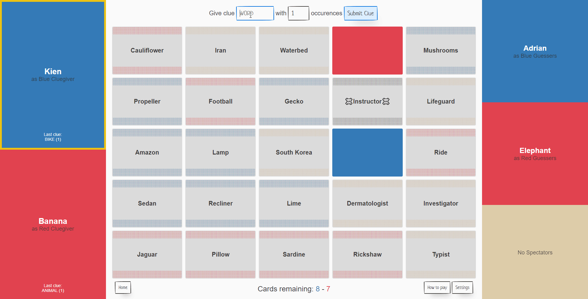
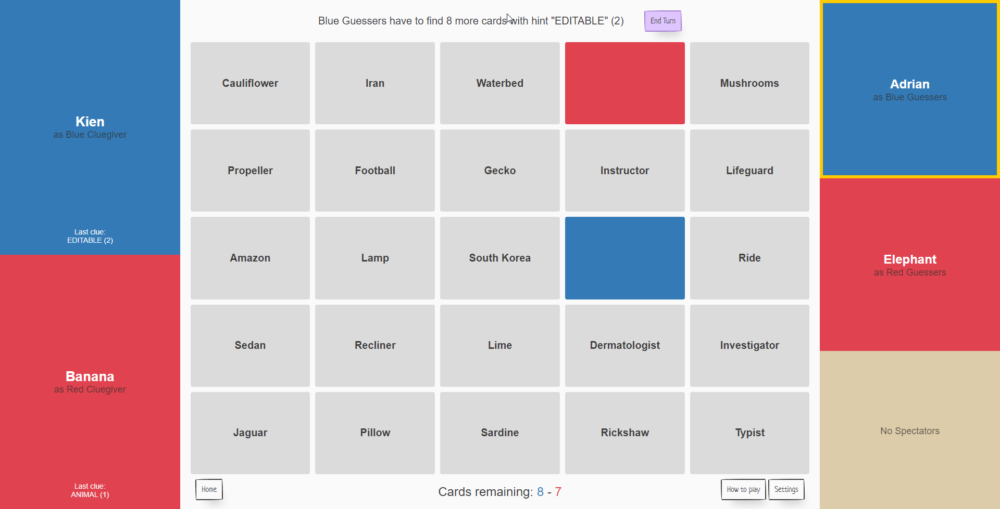

# Not Codenames

A weekend projected created by Adrian and Kien! We wanted to build a better alternatives to the other sites we used and implemented the features we would like to see in our own project. 

- Built with React and Firebase

We have open-sourced this project, feel free to contribute!

Features:
- Turn based (Yellow highlight border to signify whose turn it is)
- Distinct lobby system that shows Cluegivers and Teams
- Join codes created on start, easy to share with your friends!
- Cluegivers are the only ones who can see the actual card colours
- A submission for clue and number of words for Cluegivers
- See previous clue given by Cluegivers

Full game at https://notcodenames.com!

## Gameplay

#### Lobby System

  

#### Blue Cluegiver's Screen

  

#### Blue Team's Screen

  

- Automatically ends the blue's turn for picking the wrong card!

